# freshdesk style builder  
  
  
[데이빗의 cs App][cs]인 [freshdesk][freshdesk]의 스타일링을 처리합니다.  
  
  
  
## 개발환경 설정하기  
  
길고 귀찮고 복잡하고 시퀀셜합니다.  
열심히 기술해 볼게요. T\^T  
  
**로컬 개발환경을 설정**하고, **chrome devtools의 override** 기능으로 로컬 테스트 환경을 만들고, 마지막으로 **freshdesk 연동과  github page에 배포**까지 설명합니다.  
  
  
### 사전 설정 - freshdesk admin에서 스타일시트 추가하고 기본 폰트 설정하기  
  
제가 미리 세팅해둔 부분인데, 참고사항으로 적어둡니다.  
파일을 직접 업로드 할 수없지만 web form을 통해서 스타일링 하는 사이트는 공통으로 사용할 수 있는 방법입니다.  
  
  
1.	<http://support.daybit.com/a/admin>에 접속합니다.  
	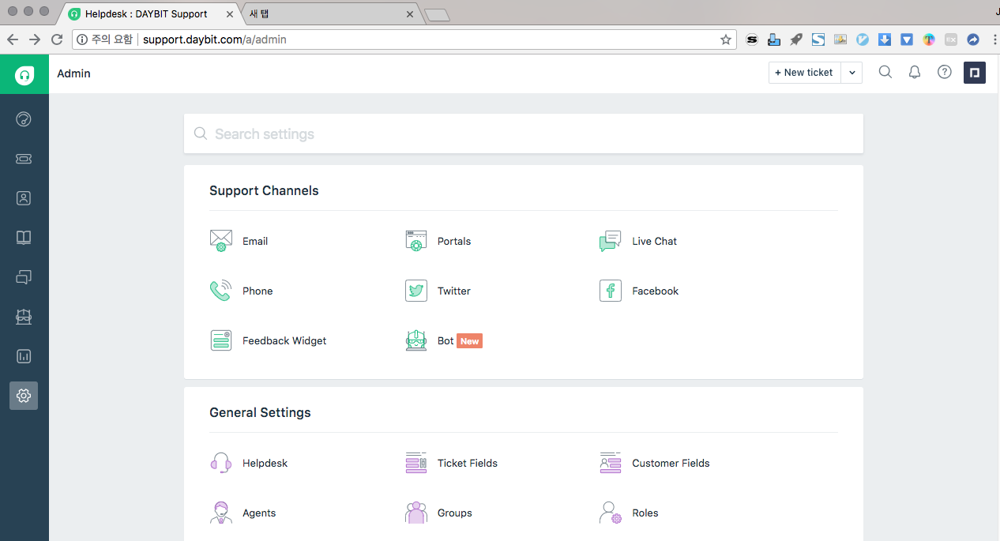  
  
2.	portals를 누릅니다.  아니면 다음의 주소로 바로 접속하셔도 됩니다.  <http://support.daybit.com/a/admin/portal>  
  
3.	`customize portal` 버튼을 클릭합니다.  
	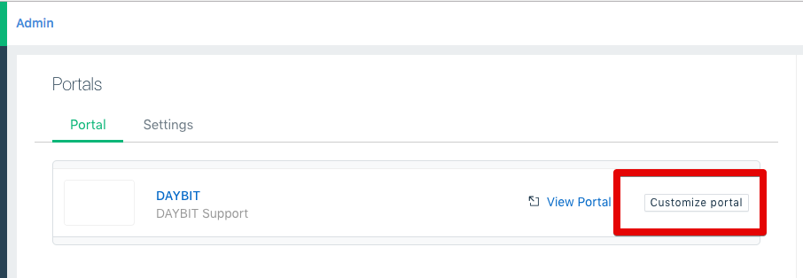  
  
4.	`layout & page` 탭으로 진입합니다.  
	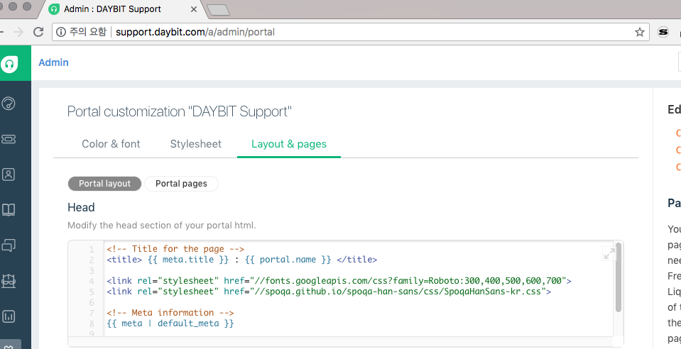  
  
5.	**daybit 거래소** 의 기본 폰트가 설정되어 있는지 확인합니다.  
	필드 중에 **Head** field가 있는데 html 구성요소 중 `head` 에서 사용되는 각종 정의를 불러옵니다.  
	이 안에 font stylesheet을 포함되었는지 확인합니다.  
	기본 폰트는 **Roboto**와 **SpoqaHanSans** 입니다.  
	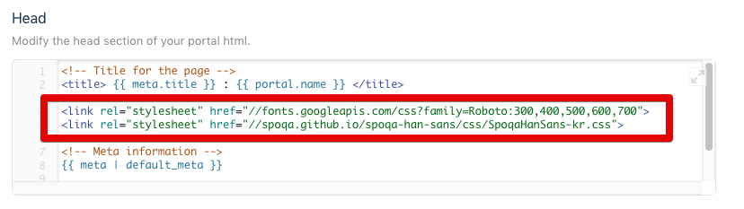  
  
6.	이제 stylesheet 탭으로 넘어갑시다.  
	Include mobile friendly stylesheet에 체크되어 있는지 확인합니다.  
	이제 github page로 배포된 스타일시트를 불러들일 차례입니다.  
	아래 주소의 스타일시트 파일을 필드에 넣어줍니다.  
  
	``` css  
	@import url('https://chain-partners.github.io/daybit-cs-freshdesk-style/style.css');  
	```  
  
	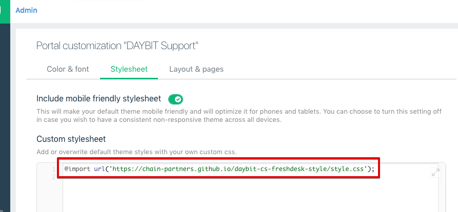  
  
  
7.	이제 데이빗 cs 사이트 <http://support.daybit.com/ko/support/home>로 이동해서 추가한 스타일시트가 잘 불러와지고 있는지 확인합시다.  
	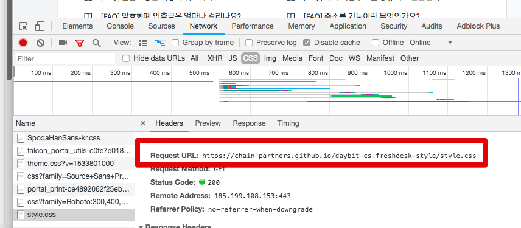  
  
  
  
--------------------------------------------------------------------------------  
  
### local 개발환경 세팅  
  
저장소를 다운로드 받아 설정하고 gulp와 기본 npm plugin을 설정합니다.  
로컬의 역할은 sass를 css로 변환한 후 특정 폴더로 이동시켜주고, sass 파일이 변화하면 자동으로 태스크를 반복 실행합니다.  
  
```  
git clone git@github.com:chain-partners/daybit-cs-freshdesk-style.git  
npm install -g gulp  
npm install  
```  
  
여기까지 로컬의 환경설정이 끝났습니다.  
  
이제 개발환경 실행을 해 봅시다.  
  
```  
gulp  
```  
  
`./deploy` 폴더가 생성되고 **style.css 파일이 생성**되는게 **확인**되어야 합니다.  
  
  
  
### chrome devtools를 이용한 로컬 개발환경 설정하기.  
  
운영중인 서비스에 파일을 배포해가면서 테스트 할 수 없으니, 스타일링만이라도 개발서버 비슷하게 꾸려봅시다.  
  
1.	크롬 개발자도구를 엽니다.  
	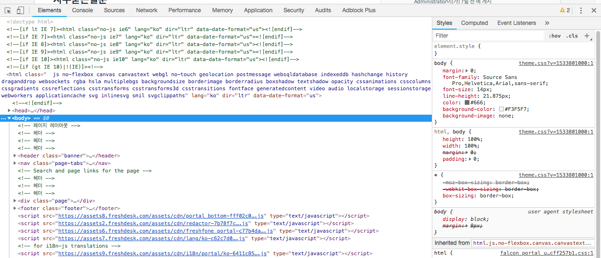  
  
2.	sources 탭을 엽니다.  
	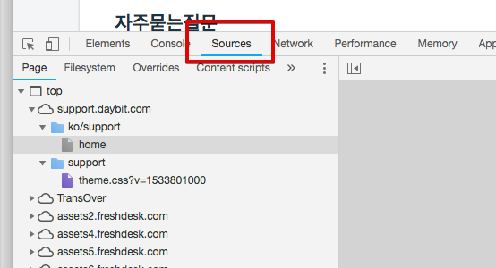  
  
3.	**sources > override** 탭을 열고 *+select folder for overrides*를 클릭합니다.  
	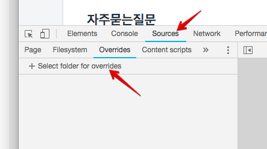  
  
4.	추가할 폴더를 골라야 하는데, 위에서 다운로드 받은 저장소의 root폴더로 잡아줍니다.  
	제 세팅을 예로 들면 이렇습니다.  `~/workspace/daybit-cs-freshdesk-style/`  
  
5.	로컬 엑세스 요청이 주소창 아래로 바로 뜹니다. **허용 눌러**줍시다.  
	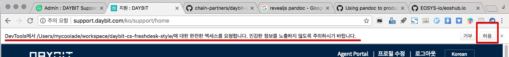  
  
6.	**chrome devtools > source > overrides**로 시선을 다시돌려서...  
	**Enable Local Overrides**에 체크되어 있는지 확인합시다.  
	그리고 로컬 액세스 대상 폴더도 잘 들어와 있는지 확인합시다.  
	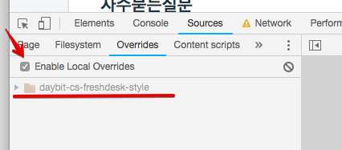  
  
7.	여기까지 확인되었으면 **source > page** 탭으로 이동합니다.  
	embed된 static resource들이 주욱 있는데요. 우리의 css파일은 github page로 호스팅되고 있으므로 **chain-partners.github.io/daybit-cs-freshdesk-style/style.css**을 찾습니다.  
	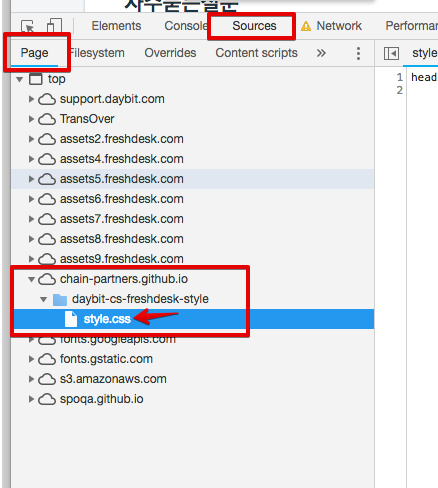  
  
8.	이 스타일시트 파일 위에서 우클릭을 합니다. 연관메뉴 중에서 **save for overrides**를 누릅니다.  
	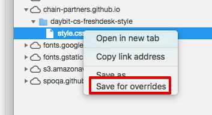  
  
9.	아이콘 모양이 변한걸 확인하세요.  
	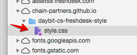  
	그러면 저장소 디렉토리에 새로운 디렉토리/파일이 추가된 것을 확인하실 수 있습니다.  
	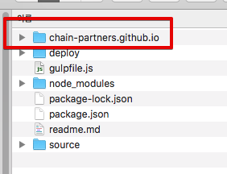  
  
10.	이제 개발을 시작하시려면 터미널에서 repo directory로 이동하신 뒤 sass 빌드명령어를 실행합니다.  
	```  
	gulp  
	```  
  
  
스타일을 수정해보고 수정된 스타일이 사이트에서 실시간 반영되는지 확인하시면 됩니다.  
  
  
  
--------------------------------------------------------------------------------  
  
  
## 개발된 스타일의 배포  
  
위에도 기술헀듯이 github pages에 배포된 파일을 freshdesk에서 embed 하는 것이기 때문에 **style.css** gh-pages branch로 배포합니다.  
  
  
``` bash  
gulp deploy  
```  
  
  
  
  
  
--------------------------------------------------------------------------------  
  
  
  
  
  
  
  
##	주의사항  
  
-	문법에 맞지않는 css 구문이 감지되면 스타일 파일이 그냥 죽어버립니다. 주의하세용.  
-	elements에서 css 선언 수정하지 마세용. 계속 리로딩되는 버그가 있습니당.  
-	html 수정은 freshdesk의 admin에서 직접 수정해야 합니다.  
  
  
  
  
<!-- link -->  
[cs]: http://support.daybit.com  
[freshdesk]: http://support.daybit.com/a/admin  
